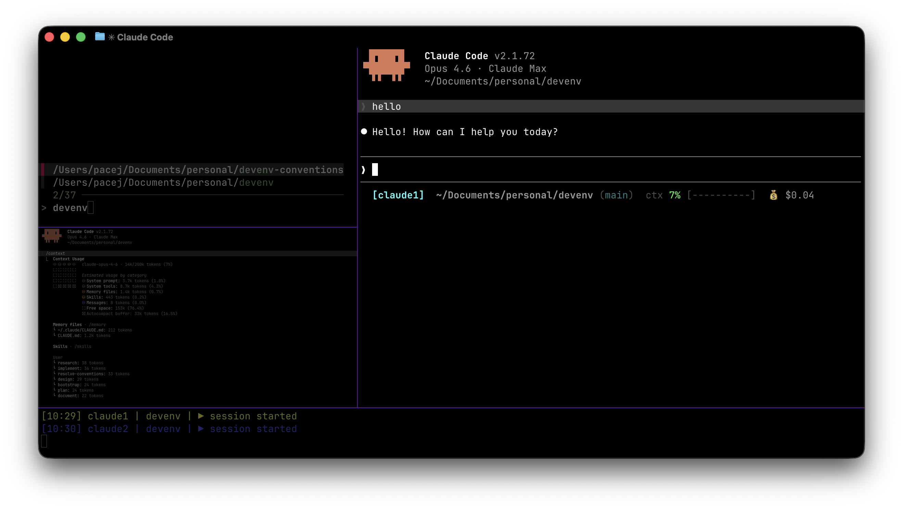

# devenv

My personal dev environment for working with Claude Code on macOS. It sets up a terminal, shell, and prompt, and installs the [devloop](https://github.com/minusblindfold/devloop) plugin for structured feature work. Everything is managed with symlinks — clone it, run the install script, and it wires itself into place.

This is opinionated and intentionally simple. It's not a framework. It's an example of what works for me. Look through it, take what's useful, ignore the rest.



## What's inside

### Terminal

[Ghostty](https://ghostty.org/) config with split panes and a project picker. `Cmd+P` (Ghostty keybind) or `Ctrl+P` (zsh widget) opens a fuzzy finder to jump between project directories.

### Shell

Zsh with a [Starship](https://starship.rs/) prompt showing git branch, language versions, and status. Modular config in `zsh/conf.d/` — path, prompt, aliases, widgets, SSH agents, and a local override file (`~/.zshrc.local`) for machine-specific config that isn't tracked.

### Claude Code

Workflow skills are provided by the [devloop](https://github.com/minusblindfold/devloop) plugin (`/dl:brainstorm` → `/dl:research` → `/dl:plan` → `/dl:design` → `/dl:implement` → `/dl:review`). The install script registers the devloop marketplace and installs the plugin automatically. See the [guide](docs/guide.md) for a walkthrough.

Personal Claude config (hooks, statusline, global instructions) stays in this repo under `claude/`. Its `settings.json` also enables two plugins: `dl@devloop-marketplace` (the workflow skills above) and `swift-lsp@claude-plugins-official` (Swift language server).

### CLI tools

Small scripts symlinked to `~/.local/bin/`:

| Command | What it does |
|---------|-------------|
| `cheat` | Render markdown cheatsheets with glow |
| `view-brainstorm` | Browse brainstorm decision logs |
| `view-research` | Browse research artifacts |
| `view-plan` | Browse saved plans with fzf + glow |
| `view-design` | Browse saved designs (ctrl-d opens diagrams) |
| `view-implement` | Browse implementation notes |
| `view-review` | Browse code review findings |
| `open-diagrams` | Open .mmd architecture diagrams in the browser |
| `picker-paths` | Manage project picker search directories |
| `claude-context` | Statusline showing directory, git branch, context %, session cost |

See the [cheatsheet](docs/cheatsheet.md) for the full reference.

### Hooks

Two distinct hook layers, wired differently.

**Git hooks** (`git-hooks/`, wired via a global `core.hooksPath`):
- `pre-commit` — runs `shellcheck` and `shfmt` on staged shell scripts (skips zsh files).
- `post-commit` — appends the commit message to `~/.claude/activity.log`.

**Claude Code hooks** (`claude/hooks/`, wired via `settings.json`):
- `check-branch.sh` — a `PreToolUse` hook matching Bash `git commit` calls. Blocks the commit if the current branch is `main`/`master`, requiring a `feature/<slug>` branch first. Resolves the actual target repo from a leading `cd <dir> &&` or `git -C <dir>` in the command, so multi-repo commands (e.g. `cd ../other-repo && git commit ...`) get checked against that repo's branch, not just the hook's own invocation cwd.
- `log-activity.sh` — fires on `SessionStart`, `PostToolUse`, `SubagentStart`, and `SubagentStop`, appending structured activity lines to the same `~/.claude/activity.log`.

## Quickstart

Requires macOS and [Homebrew](https://brew.sh/), and Claude Code ≥ 2.1.181 (≥ 2.1.198 for `/dl:implement all`) — devloop's floor, needed for nested subagent depth and custom agent support; the higher bar for `all` mode reflects subagents defaulting to background from that version, which `/dl:implement all` needs to run in the foreground to keep each task's verify-and-commit step atomic.

```bash
git clone https://github.com/minusblindfold/devenv.git ~/path/of/your/choice
cd ~/path/of/your/choice
./install.sh
./verify.sh
```

Restart your terminal after install.

The install script is idempotent — safe to run multiple times. It symlinks everything into place and backs up any existing files to `~/.dotfiles_backup/<timestamp>/` before replacing them. Dependencies are installed automatically via the Brewfile:

| Tool | Purpose |
|------|---------|
| `ghostty` | Terminal emulator |
| `claude-code@latest` | Claude Code CLI |
| `fzf` | Fuzzy finder (project picker, viewers) |
| `glow` | Markdown renderer (cheat, viewers) |
| `starship` | Shell prompt |
| `jq` | JSON processing (bin scripts) |
| `gh` | GitHub CLI |
| `shellcheck` | Shell script linter (pre-commit hook) |
| `shfmt` | Shell script formatter (pre-commit hook) |
| `bun` | JS runtime (`bunx ccusage` for cost tracking) |
| `font-jetbrains-mono-nerd-font` | Nerd font for terminal icons |

<details>
<summary>Troubleshooting</summary>

**`font-jetbrains-mono-nerd-font` not found**

On Homebrew older than 4.x, cask fonts live in a separate tap:

```bash
brew tap homebrew/cask-fonts
brew install --cask font-jetbrains-mono-nerd-font
```

</details>

## Adding your own config

Files ending in `.symlink` are linked into `$HOME` with a dot prefix (e.g., `git/gitconfig.symlink` → `~/.gitconfig`). For tools with complex layouts, there's a dedicated `install_*()` function in `install.sh`. Run `./install.sh` after adding anything.

## Uninstalling

```bash
./uninstall.sh
```

Removes all symlinks and config that `install.sh` created. Only removes symlinks that point back to this repo — real files and user customizations are left untouched. Homebrew packages are left in place (uninstall manually if needed). Safe to run multiple times.

## Updating

Pull the repo and re-run `./install.sh`. Symlinked config updates in place. The devloop plugin updates separately via `claude plugin update dl@devloop-marketplace`.

## Links

- [Guide](docs/guide.md) — terminal setup, the skill workflow, rules, and tips
- [Cheatsheet](docs/cheatsheet.md) — quick reference for all keybindings, commands, and CLI tools
- [devloop](https://github.com/minusblindfold/devloop) — the Claude Code plugin powering the workflow skills
  - [`examples/rule-packs/`](https://github.com/minusblindfold/devloop/tree/main/examples/rule-packs) — copy-paste starter rule packs
  - [`docs/rules.md`](https://github.com/minusblindfold/devloop/blob/main/docs/rules.md) — rule file format spec

## License

[MIT](LICENSE)
