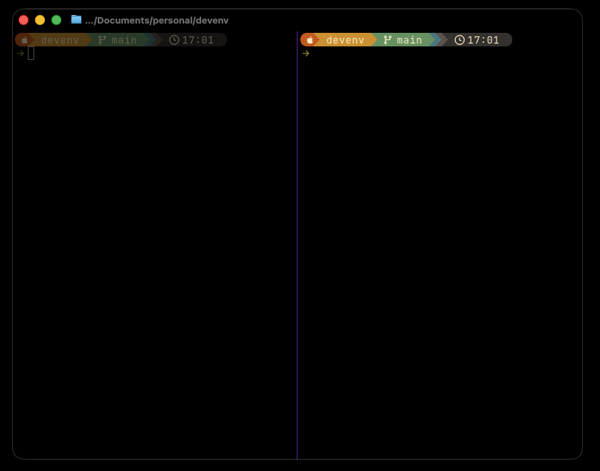
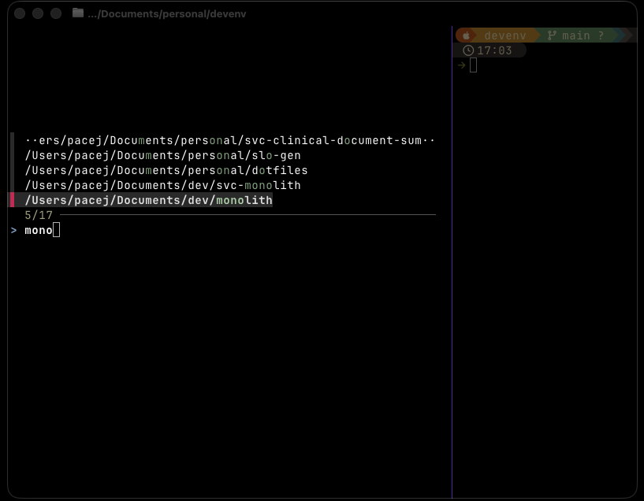
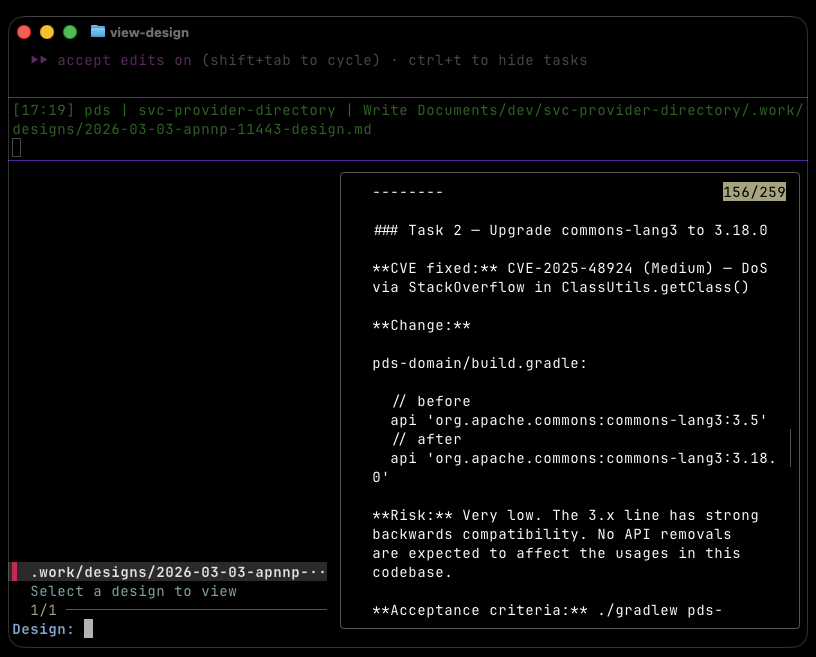
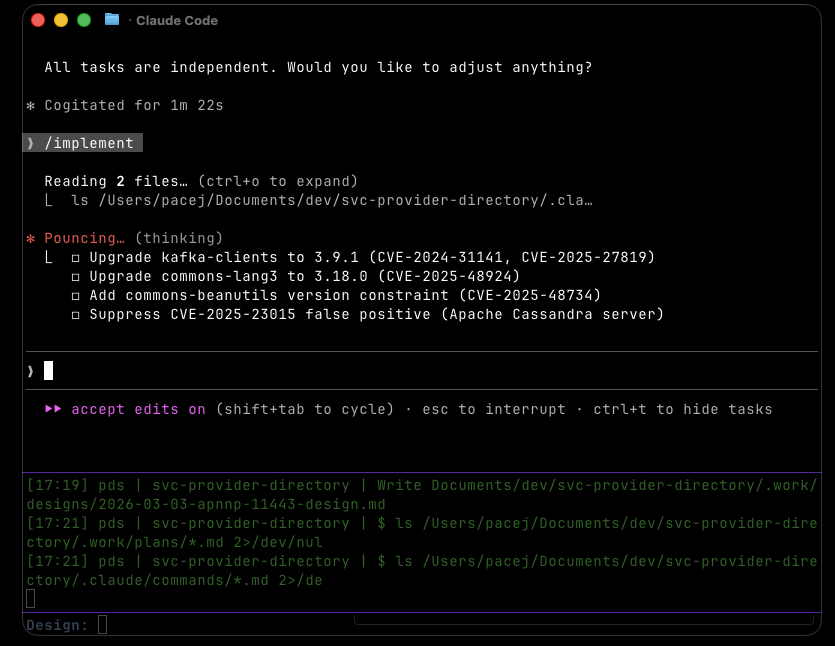

# devenv Guide

A practical walkthrough of the dev environment — from first launch to shipping a feature with Claude.

> New here? Start with the [Setup guide](../SETUP.md) first.

---

## The Setup

This environment runs entirely in the terminal. One tool at the centre: **Ghostty** — a fast, GPU-accelerated terminal with first-class split pane support.

Split your workspace with `Cmd+Shift+Arrow`. A typical layout is two vertical panes: Claude on the left, a shell on the right for running commands, watching logs, or reviewing output.



Navigate between panes with `Cmd+Arrow`. Close one with `Cmd+X`.

The prompt is powered by **Starship** — it shows git branch, status, and language context at a glance.

---

## Jumping to a Project

Press `Ctrl+P` from anywhere to open the fuzzy project picker. Start typing to filter — it searches all your project directories instantly.



---

## Finding Your Bearings

Not sure what's available? Run `cheat`:

```bash
cheat           # full cheatsheet
cheat ls        # list tool-specific sheets
cheat ghostty   # ghostty key bindings
```

---

## The Claude Workflow

The real power of this environment is a structured AI-assisted dev loop built on three skills:

[`/plan`](../claude/skills/plan/SKILL.md) → [`/design`](../claude/skills/design/SKILL.md) → [`/implement`](../claude/skills/implement/SKILL.md)

Each step saves a versioned artifact to `.work/` in your project. Every artifact is backed up before it's overwritten — you can always roll back.

---

### Step 1 — [Plan](../claude/skills/plan/SKILL.md)

Navigate to your project, open Claude, and describe what you want to build:

```
/plan add user authentication
```

Claude asks a handful of clarifying questions (scope, constraints, stack), then produces a numbered task list ordered by dependency. The plan is saved to `.work/plans/` — use [`view-plan`](../bin/view-plan) to review it at any time.

Push back, reorder tasks, merge or split them. Claude won't touch code until you're happy.

---

### Step 2 — [Design](../claude/skills/design/SKILL.md)

Once the plan is locked, generate a high-level design:

```
/design
```

Claude reads the plan, explores the codebase, and produces an architecture overview and a spec for every task. Architecture diagrams are saved as `.mmd` files alongside the design. Press `ctrl-d` in `view-design` to open them rendered in the browser.



The design is saved to `.work/designs/`. Review it the same way as the plan — iterate until it's right. Use [`view-design`](../bin/view-design) to browse designs at any time.

---

### Step 3 — [Implement](../claude/skills/implement/SKILL.md)

Pick a task:

```
/implement
```

Claude loads the plan and design, displays the full task list with completion status, and gets to work on whichever task you choose.



It reads relevant files first, implements the task, and checks its work against the acceptance criteria. An implementation note is saved to `.work/implementations/` — use [`view-implement`](../bin/view-implement) to browse notes across sessions.

Repeat for each task. Completed tasks are tracked so you can pick up exactly where you left off.

---

## Quick Reference

| Command | What it does |
|---------|-------------|
| [`cheat`](../bin/cheat) | Full cheatsheet |
| `Ctrl+P` | Project picker |
| [`/plan`](../claude/skills/plan/SKILL.md) `[description]` | Create or refine a plan |
| [`/design`](../claude/skills/design/SKILL.md) | Generate HLD + specs from a plan |
| [`/implement`](../claude/skills/implement/SKILL.md) `[slug [task-n]]` | Implement a task |
| [`view-plan`](../bin/view-plan) | Browse saved plans |
| [`view-design`](../bin/view-design) | Browse saved designs |
| [`view-implement`](../bin/view-implement) | Browse implementation notes |

Work artifacts live in `.work/` inside your project — add `.work/` to `.gitignore`.

---

## Tips

- **Run [`/plan`](../claude/skills/plan/SKILL.md) with no args** to get a picker of existing plans — useful when picking up work across sessions.
- **[`work-as`](../bin/work-as) `<name>`** launches Claude as a named agent. Activity is logged to `~/.claude/activity.log` with the agent name.
- **[`watch-agents`](../bin/watch-agents)** tails the activity log with color-coded output by agent — open it in the right pane while Claude works in the left.
- **`~/.zshrc.local`** is sourced automatically and not tracked.
