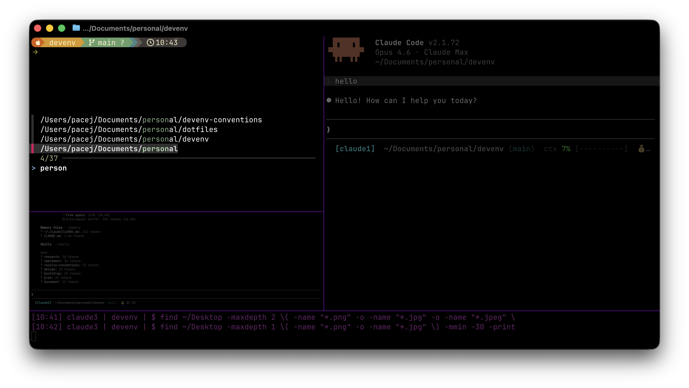
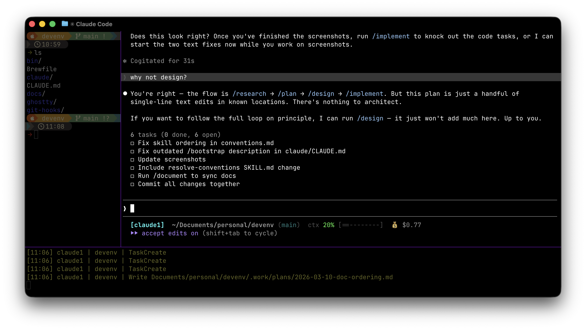
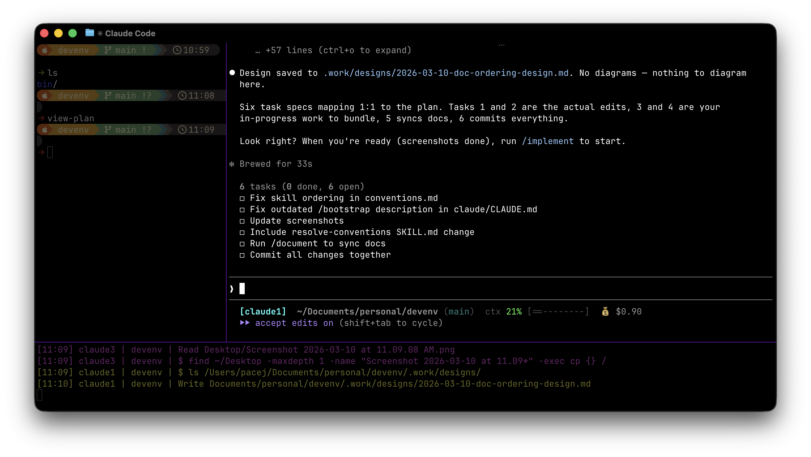
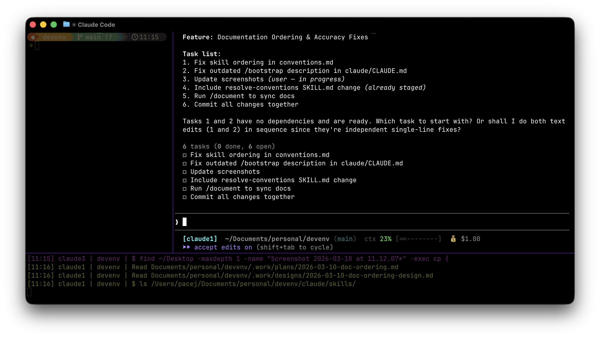

# Guide

Everything here assumes you've already run `./install.sh` and restarted your terminal. If not, see the [quickstart](../README.md#quickstart) in the README.

---

## Terminal

Everything runs in **Ghostty** — a fast, GPU-accelerated terminal with native split panes.

### Panes

| Key | Action |
|-----|--------|
| `Cmd+Shift+Arrow` | Split in that direction |
| `Cmd+Arrow` | Navigate between panes |
| `Cmd+X` | Close pane |

A typical layout: Claude on the left, a shell on the right for running commands or watching output.

### Project picker

Press `Cmd+P` (Ghostty keybind) or `Ctrl+P` (zsh widget) to fuzzy-find and jump to a project directory. Both read from `~/.config/devenv/paths`.



Manage search paths with `picker-paths`:

```bash
picker-paths list                    # show configured paths
picker-paths add ~/Documents/work    # add a root directory
picker-paths remove ~/Documents/work # remove one
```

---

## Shell and prompt

The prompt is **Starship** — it shows git branch, language versions, and status icons. Config lives in `starship/starship.toml`.

| Alias | Expands to |
|-------|-----------|
| `ls` | `ls -1F` |
| `zshconfig` | Opens `~/.zshrc` in your editor |
| `zshlocal` | Opens `~/.zshrc.local` in your editor |

Machine-specific config (API keys, work paths, tool overrides) goes in `~/.zshrc.local`. It's sourced automatically and not tracked by git.

Run `cheat` from anywhere to see the full cheatsheet rendered with glow:

```bash
cheat           # full cheatsheet
cheat ls        # list available sheets
cheat ghostty   # ghostty keybindings
```

---

## The skill loop

AI coding agents can generate anything, which is the problem. Without structure you get inconsistent patterns and one-shot attempts that miss edge cases. This setup structures work into phases — sometimes called [harness engineering](https://martinfowler.com/articles/exploring-gen-ai/harness-engineering.html) — so the agent's output stays consistent and reviewable.

```
         /research → /plan → /design → /implement
              ↑         ↑       ↑          │
              └─────────┴───────┴──────────┘

    During any phase, run /research to feed discoveries back into plans and designs.
```

Each step produces an artifact that the next step reads. No step touches code until `/implement`. Artifacts are saved to `.work/` in whatever project you're working in — add `.work/` to that project's `.gitignore`.

### /research

```
/research "topic"
```

Scans your convention docs and codebase for context. Produces three sections: **Applicable Conventions** (what rules exist), **Codebase Patterns** (what's already built), and **Gaps & Recommendations** (what's missing or inconsistent).

Research is optional but useful before planning. Run it again at any point — it appends new findings without overwriting prior sections.

### /plan

```
/plan "feature"
```

Claude asks clarifying questions (scope, constraints, entities), then produces a task list ordered by dependency. The plan is saved to `.work/plans/`.



If research artifacts exist for the feature, `/plan` reads them automatically — the gaps and recommendations inform the questions and tasks.

Push back. Reorder tasks, split or merge them, add constraints. Claude won't touch code.

```
/plan                    # picker if plans exist, or ask what to plan
/plan <slug>             # refine an existing plan
```

### /design

```
/design
```

Claude reads the plan, explores the codebase, and produces a high-level design: architecture decisions, Mermaid diagrams (saved as `.mmd` files), and a detailed spec for each task — goal, interfaces, implementation notes, acceptance criteria, and which convention docs apply.



The design is the contract for implementation. Use `view-design` to read it and press `ctrl-d` to open architecture diagrams in the browser.

For simple features where no plan exists, `/design <description>` bootstraps a minimal plan inline and proceeds to design.

### /implement

```
/implement
```

Claude loads the plan and design, displays the task list with completion status, and implements one task at a time. It reads relevant files first, checks which conventions apply, runs existing tests to establish a baseline, implements against the spec, and re-runs tests. An implementation note is saved to `.work/implementations/`.



Completed tasks are tracked — pick up exactly where you left off across sessions.

### Viewing artifacts

Four viewer scripts browse work artifacts. All use fzf for selection and glow for rendering.

| Command | Reads from |
|---------|-----------|
| `view-plan` | `.work/plans/` |
| `view-design` | `.work/designs/` |
| `view-implement` | `.work/implementations/` |
| `view-research` | `.work/research/` |

Pass a filename to view directly, or run with no args for the picker. `open-diagrams <design-file>` opens `.mmd` diagrams in the browser.

---

## Conventions

Convention docs are markdown files that the agent reads at runtime. They describe patterns — how entities should look, how services are structured, how security works. This isn't documentation for humans. It's guidance the agent follows while generating code.

They live in `~/.claude/conventions/` and are discovered automatically via YAML frontmatter:

```yaml
---
keywords: [entity, model, JPA, persistence]
scope: all          # bootstrap | feature | all
---
# JPA Entity Conventions

> How we structure JPA entities with Lombok...

## Rules
...

## Bootstrap
Create a Role enum and a User entity...
```

The `scope` field controls when a convention applies: `bootstrap` (scaffolding only), `feature` (feature work only), or `all` (both — the default).

### Progressive model

Start simple — drop a few `.md` files into `~/.claude/conventions/`. Skills discover them automatically. No config needed.

When you want more structure, install [devenv-conventions](https://github.com/minusblindfold/devenv-conventions) for organized packs with a CLI (`devenv-conventions enable/disable/list`). Packs add layered resolution — multiple convention sets active simultaneously with precedence ordering. Flat files in `~/.claude/conventions/` always serve as the lowest-precedence fallback.

With no conventions configured, skills still work — they operate from codebase context alone. Conventions are additive, not required (except for `/bootstrap`, which needs at least a `stack.md`).

---

## Working effectively

### Mid-loop corrections

If `/implement` produces something that doesn't match your expectations, don't just fix the code. Ask what was missing:

- **Design gap?** Run `/design refine` to tighten the spec before continuing.
- **Plan gap?** Run `/plan refine` to add a missing task or adjust scope.
- **Convention gap?** Update the convention doc so every future task gets it right.
- **New discovery?** Run `/research` to capture it — the findings inform the next plan.

### Context hygiene

Claude's output degrades as context fills up. The phased workflow helps — each skill starts with a focused read of specific artifacts rather than accumulating a session's worth of conversation.

If you've corrected Claude multiple times on the same issue, the context can become cluttered with failed approaches. Run `/clear` and start fresh with a more specific prompt. A clean session with a better prompt almost always outperforms a long correction chain.

### Tips

- **Start small.** Don't plan 15 tasks. Start with 3-5. You can always `/plan refine` to add more.
- **Let Claude interview you.** Give a short description and let Claude ask the clarifying questions. They often surface constraints you hadn't considered.
- **Review artifacts, not just code.** Use `view-plan`, `view-design`, and `view-implement` between sessions. The artifacts capture decisions and rationale that git commits don't.
- **One task at a time.** `/implement` works on a single task per invocation. This keeps context focused and changes reviewable.
- **Commit after each task.** Small, well-described commits make review and rollback easy.
- **Use /research as a re-entry point.** Discovered something unexpected? Run `/research` to capture it, then refine the plan or design. The workflow is a loop, not a line.

### Updating

Pull the devenv repo and re-run `./install.sh`. Because everything is symlinked, conventions, skills, and tools update in place. The same applies to convention packs if you're using devenv-conventions — `devenv-conventions update` pulls the latest for all cloned repos.

---

## Quick reference

| Command | What it does |
|---------|-------------|
| `/research [topic]` | Scan conventions + codebase for context |
| `/plan [description]` | Create or refine a task list |
| `/design [slug]` | Generate architecture + task specs from a plan |
| `/implement [slug [task-n]]` | Implement one task from a plan+design pair |
| `/bootstrap <project-name>` | Scaffold a new project from conventions |
| `view-research` | Browse saved research |
| `view-plan` | Browse saved plans |
| `view-design` | Browse saved designs (`ctrl-d` for diagrams) |
| `view-implement` | Browse implementation notes |

---

## Further reading

- [Harness Engineering](https://martinfowler.com/articles/exploring-gen-ai/harness-engineering.html) — Birgitta Böckeler on structuring systems around AI agents
- [Building Effective Agents](https://www.anthropic.com/engineering/building-effective-agents) — Anthropic's guide to agent patterns
