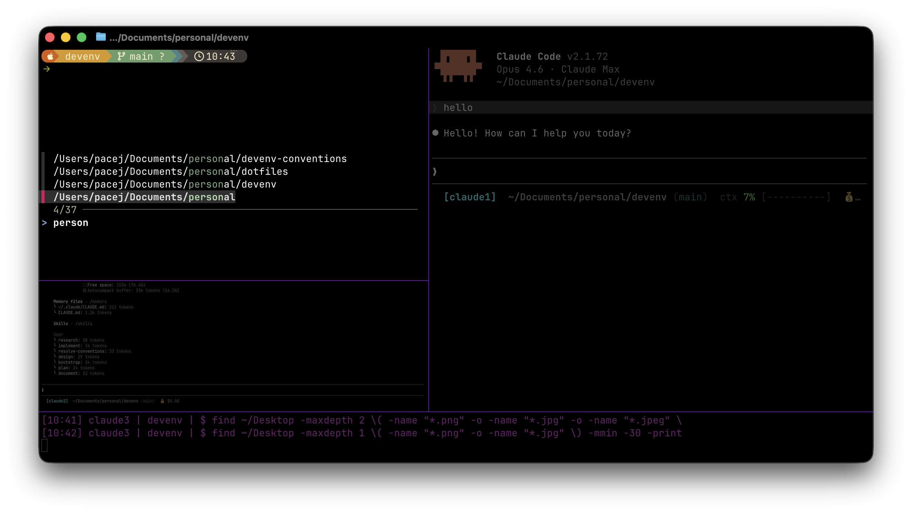
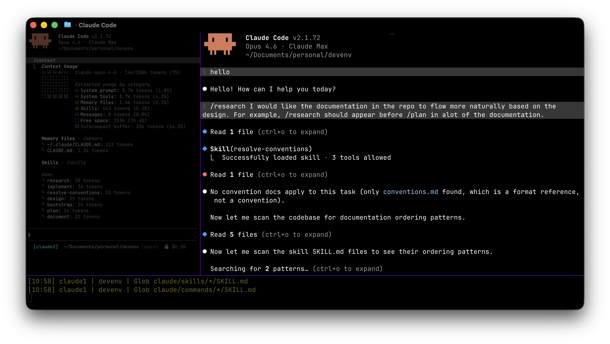
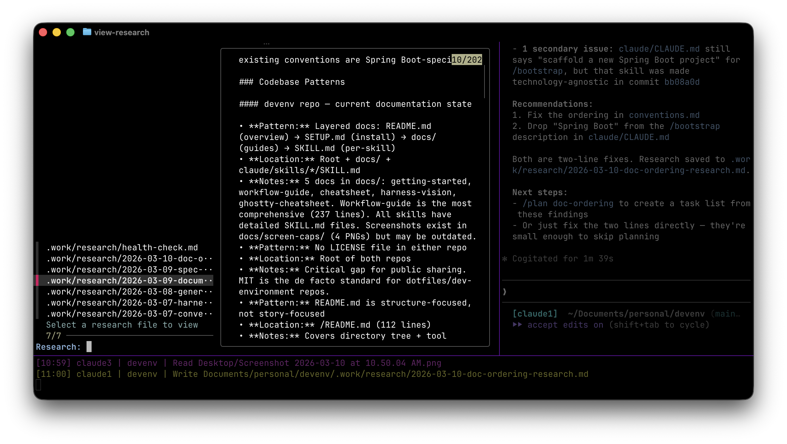
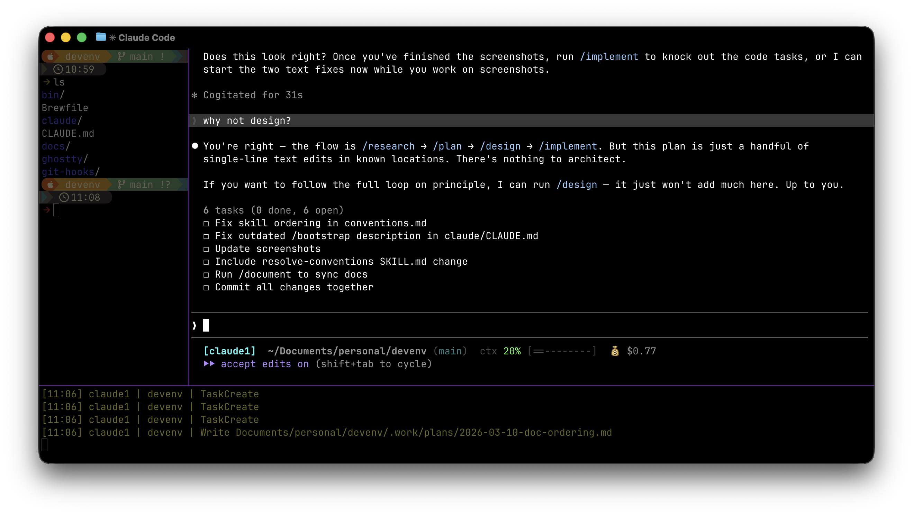
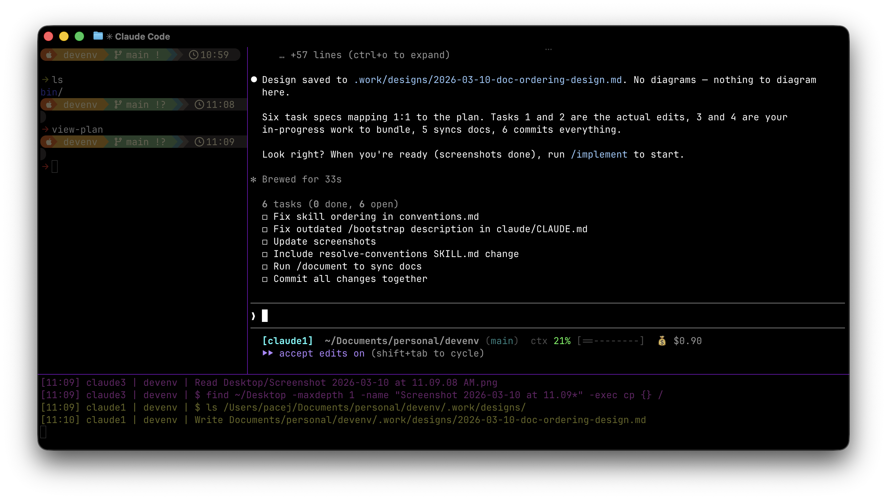
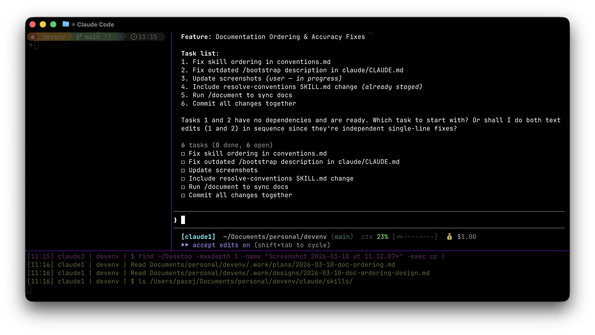

# Guide

Everything here assumes you've already run `./install.sh` and restarted your terminal. If not, see the [quickstart](../README.md#quickstart) in the README.

---

## Terminal

Everything runs in **Ghostty** — a fast, GPU-accelerated terminal with native split panes.

### Panes

| Key | Action |
|-----|--------|
| `Cmd+Shift+Arrow` | Split in that direction |
| `Cmd+Arrow` | Navigate between panes |
| `Cmd+X` | Close pane |

A typical layout: Claude on the left, a shell on the right for running commands or watching output.

### Project picker

Press `Cmd+P` (Ghostty keybind) or `Ctrl+P` (zsh widget) to fuzzy-find and jump to a project directory. Both read from `~/.config/devenv/paths`.



Manage search paths with `picker-paths`:

```bash
picker-paths list                    # show configured paths
picker-paths add ~/Documents/work    # add a root directory
picker-paths remove ~/Documents/work # remove one
```

---

## Shell and prompt

The prompt is **Starship** — it shows git branch, language versions, and status icons. Config lives in `starship/starship.toml`.

| Alias | Expands to |
|-------|-----------|
| `ls` | `ls -1F` |
| `zshconfig` | Opens `~/.zshrc` in your editor |
| `zshlocal` | Opens `~/.zshrc.local` in your editor |

Machine-specific config (API keys, work paths, tool overrides) goes in `~/.zshrc.local`. It's sourced automatically and not tracked by git.

Run `cheat` from anywhere to see the full cheatsheet rendered with glow:

```bash
cheat           # full cheatsheet
cheat ls        # list available sheets
cheat ghostty   # ghostty keybindings
```

---

## The skill loop

> **Standalone plugin?** If you're using [devloop](https://github.com/minusblindfold/devloop) without devenv, see the plugin's [workflow docs](https://github.com/minusblindfold/devloop/blob/main/docs/workflow.md) instead. This section covers the same workflow with devenv-specific terminal integration.

AI coding agents can generate anything, which is the problem. Without structure you get inconsistent patterns and one-shot attempts that miss edge cases. This setup structures work into phases — sometimes called [harness engineering](https://martinfowler.com/articles/exploring-gen-ai/harness-engineering.html) — so the agent's output stays consistent and reviewable.

```
  /dl:brainstorm → /dl:research → /dl:plan → /dl:design → /dl:implement → /dl:review
                        ↑              ↑            ↑             │
                        └──────────────┴────────────┴─────────────┘

    Start with /dl:brainstorm. Re-enter /dl:research when discoveries surface.
```

Each step produces an artifact that the next step reads. No step touches code until `/dl:implement`. Artifacts are saved to `.work/` in whatever project you're working in — add `.work/` to that project's `.gitignore`.

### /dl:brainstorm

```
/dl:brainstorm "topic"
```

Recommended entry point. Iterative questioning session that probes a feature idea. Claude resolves rules, scans the codebase, and asks rounds of questions — each with a recommended answer you can accept, reject, or refine. The conversation continues until you signal you're done or the decision space converges.

The output is a decision log with research queries saved to `.work/brainstorms/`. The Research Queries section drives what `/dl:research` investigates next.

```
/dl:brainstorm                  # ask what to brainstorm
/dl:brainstorm <slug>           # reopen an existing brainstorm
```

### /dl:research

```
/dl:research "topic"
```

Executes the Research Queries from your brainstorm artifact as targeted codebase searches. Requires a brainstorm artifact. Produces per-query findings and a **Gaps & Recommendations** section.

Run it again at any point — it appends new findings without overwriting prior sections.



Use `view-research` to browse saved research across sessions.



### /dl:plan

```
/dl:plan "feature"
```

Claude asks clarifying questions (scope, constraints, entities), then produces a task list ordered by dependency. The plan is saved to `.work/plans/`.



If research artifacts exist for the feature, `/dl:plan` reads them automatically — the gaps and recommendations inform the questions and tasks.

Push back. Reorder tasks, split or merge them, add constraints. Claude won't touch code.

```
/dl:plan                    # picker if plans exist, or ask what to plan
/dl:plan <slug>             # refine an existing plan
```

### /dl:design

```
/dl:design
```

Claude reads the plan, explores the codebase, and produces a high-level design: architecture decisions, Mermaid diagrams (saved as `.mmd` files), and a detailed spec for each task — goal, interfaces, implementation notes, acceptance criteria, and which rule docs apply.



The design is the primary review checkpoint — review it thoroughly before implementation. Use `view-design` to read it and press `ctrl-d` to open architecture diagrams in the browser.

### /dl:implement

```
/dl:implement                   # pick a task
/dl:implement <slug> <N>        # implement task N
/dl:implement <slug> all        # run every unchecked task in order
```

Claude acts as a foreman: it loads the plan and design, displays the task list with completion status, and delegates the selected task to a fresh-context worker. The worker reads relevant files first, checks which rules apply, runs existing tests to establish a baseline, implements against the spec, and re-runs tests. An implementation note is saved to `.work/implementations/`.



**Single-task mode** implements one task per invocation and suggests a commit at the end.

**All mode** (`all`) first self-heals `.gitignore` to cover `.work/` if it doesn't already (committing that bootstrap fix alone), then requires a clean working tree, then loops over every unchecked task in plan order, committing each one separately as it completes. It halts — leaving the task box unchecked — if a task fails, targets a separate repo, or declares an interface-changing deviation; re-run `/dl:implement <slug> all` to resume from the first unchecked task. When the last task lands, it automatically runs `/dl:review` in a forked subagent.

Completed tasks are checked off in the plan file itself — pick up exactly where you left off across sessions.

### /dl:review

```
/dl:review [feature-slug]
```

Reviews the current diff for rule violations and quality issues. Works standalone or as the automatic final step of `/dl:implement <slug> all`.

**Mode detection:** If a plan and design exist for the slug, review runs in **workflow mode** — it pulls rule titles straight from the task specs and treats deviations noted as intentional in implementation notes as acknowledged, not violations. Without a plan or design, it runs in **standalone mode** — deriving keywords from the slug (or the current branch name, if no slug is given) to match against `devloop/rules/`. Pointing it at an existing review file triggers **re-entry** — findings are appended as a dated section rather than replacing the prior review.

**Diff scope:** On a feature branch, it reviews `git diff main...HEAD` plus any uncommitted changes. On `main`, it reviews uncommitted changes only, and stops if there are none.

Review runs in a forked subagent — the scanning happens in a fresh context and only findings return to your session. On completion, it archives the feature's active marker; the workflow is considered done — since everything is captured in commits and `.work/` artifacts, it's a good point to `/compact` or start a fresh session before the next feature.

```
/dl:review                  # detect branch or active marker, review what's there
/dl:review <slug>           # review a specific feature by slug
```

### Viewing artifacts

Six viewer scripts browse work artifacts. All use fzf for selection and glow for rendering.

| Command | Reads from |
|---------|-----------|
| `view-brainstorm` | `.work/brainstorms/` |
| `view-research` | `.work/research/` |
| `view-plan` | `.work/plans/` |
| `view-design` | `.work/designs/` |
| `view-implement` | `.work/implementations/` |
| `view-review` | `.work/reviews/` |

Pass a filename to view directly, or run with no args for the picker. `open-diagrams <design-file>` opens `.mmd` diagrams in the browser.

---

## Multi-agent workflows

Run more than one Claude Code session at once — one per feature, each in its own Ghostty pane — and the shared activity log (written by `claude/hooks/log-activity.sh`) mixes every session's tool calls and commits together with no indication of which session did what. `work-as` and `watch-agents` fix that by tagging each session with a name and letting you colorize the merged log by that name.

```bash
work-as alpha    # launch Claude Code, tagging this session "alpha"
work-as beta     # in another pane, tag that session "beta"
```

`work-as <name> [args]` sets `CLAUDE_AGENT=<name>` in the shell and writes `<name>` to `~/.claude/agent` before launching `claude` (any extra args are passed through), then cleans up both when the session exits. Every activity-log line `log-activity.sh` writes during that session — tool calls, commits — carries `<name>`, so lines from concurrent sessions stay attributable even though they land in the same shared file.

`watch-agents` tails `~/.claude/activity.log` and pipes it through a small colorizer that assigns each distinct agent name a color the first time it appears, cycling through up to 12 ANSI colors, so `alpha`'s lines and `beta`'s lines are visually distinct at a glance without grepping or filtering.

This is most useful when you're juggling several features at once: run `work-as <feature-name>` for each concurrent session, then keep a `watch-agents` pane open as a shared, color-coded view of what every agent is doing in real time.

---

## Rules

Rules are markdown files in `devloop/rules/` at your project root. They describe patterns — how entities should look, how services are structured, how security works. This isn't documentation for humans. It's guidance devloop skills apply while generating code. Skills discover the directory automatically; commit it to version control like any other project file.

Create `devloop/rules/` and drop in a `.md` file:

```yaml
---
keywords: [entity, model, JPA, persistence]
---
# JPA Entity Rules

> How we structure JPA entities with Lombok...

## Patterns
...

## Bootstrap
Create a Role enum and a User entity...
```

Add one rule per concern (`service.md`, `controller.md`, `testing.md`).

### Frontmatter

| Field | Required | Description |
|---|---|---|
| `keywords` | No | Terms matched against the task or topic. A rule without `keywords` applies to every task — use for cross-cutting conventions. |
| `repos` | No | Home-relative paths (`~/...`) to related local repos. `/dl:brainstorm` and `/dl:research` scan them for cross-repo context (integration points, API contracts, shared types). Missing repos are skipped. |

Most skills match your task description against `keywords` and pull in what's relevant — a task about services loads `service.md`, not `testing.md`. No `devloop/rules/` directory? Skills work from codebase context alone; rules are additive, not required.

### Why not `.claude/rules/`?

Claude Code natively loads every file in `.claude/rules/` into every session (optionally scoped by `paths:` globs). That's fine for a handful of always-on rules, but it defeats keyword scoping — a large rule set crowds the context window with guidance irrelevant to the task at hand. `devloop/rules/` loads only what matches instead. The two are complementary, not competing: use `.claude/rules/` for things every session needs, `devloop/rules/` for pattern guidance skills pull in on demand.

### Rule packs

Rule packs are ready-made rule sets, copy-paste only — there's no CLI and nothing gets symlinked. Copy a pack from devloop's [`examples/rule-packs/`](https://github.com/minusblindfold/devloop/tree/main/examples/rule-packs) into your project's `devloop/rules/` and edit the copies freely; they're yours from that point on. Full format spec: [`docs/rules.md`](https://github.com/minusblindfold/devloop/blob/main/docs/rules.md).

---

## Working effectively

### Mid-loop corrections

If `/dl:implement` produces something that doesn't match your expectations, don't just fix the code. Ask what was missing:

- **Design gap?** Run `/dl:design` again with the same slug to tighten the spec before continuing.
- **Plan gap?** Run `/dl:plan` again with the same slug to add a missing task or adjust scope.
- **Rule gap?** Update the rule doc so every future task gets it right.
- **New discovery?** Run `/dl:research` to capture it — the findings inform the next plan.

### Context hygiene

Claude's output degrades as context fills up. The phased workflow helps — each skill starts with a focused read of specific artifacts rather than accumulating a session's worth of conversation.

If you've corrected Claude multiple times on the same issue, the context can become cluttered with failed approaches. Run `/clear` and start fresh with a more specific prompt. A clean session with a better prompt almost always outperforms a long correction chain.

### Tips

- **Start small.** Don't plan 15 tasks. Start with 3-5. You can always run `/dl:plan` again to add more.
- **Let Claude interview you.** Give a short description and let Claude ask the clarifying questions. They often surface constraints you hadn't considered.
- **Review artifacts, not just code.** Use `view-plan`, `view-design`, and `view-implement` between sessions. The artifacts capture decisions and rationale that git commits don't.
- **One task at a time.** `/dl:implement` works on a single task per invocation. This keeps context focused and changes reviewable.
- **Commit after each task.** Small, well-described commits make review and rollback easy.
- **Use /dl:research as a re-entry point.** Discovered something unexpected? Run `/dl:research` to capture it, then refine the plan or design. The workflow is a loop, not a line.

### Updating

Pull the devenv repo and re-run `./install.sh` for terminal, shell, and personal config updates. The devloop plugin updates separately via `claude plugin update dl@devloop-marketplace`. Rule packs copied from `examples/rule-packs/` are yours to maintain — re-copy or diff against the source manually if devloop publishes updates.

---

## Quick reference

| Command | What it does |
|---------|-------------|
| `/dl:brainstorm [topic]` | Recommended entry point — refine a feature idea, produce research queries |
| `/dl:research [topic]` | Execute research queries from brainstorm as targeted searches |
| `/dl:plan [description]` | Create or refine a vertically-sliced task list |
| `/dl:design [slug]` | Primary review checkpoint — architecture + task specs from a plan |
| `/dl:implement [slug [task-n\|all]]` | Implement one task (or all unchecked tasks) from a plan+design pair |
| `/dl:review [feature-slug]` | Review the diff for rule violations and quality issues |
| `view-brainstorm` | Browse brainstorm decision logs |
| `view-research` | Browse saved research |
| `view-plan` | Browse saved plans |
| `view-design` | Browse saved designs (`ctrl-d` for diagrams) |
| `view-implement` | Browse implementation notes |
| `view-review` | Browse code review findings |

---

## Further reading

- [Harness Engineering](https://martinfowler.com/articles/exploring-gen-ai/harness-engineering.html) — Birgitta Böckeler on structuring systems around AI agents
- [Building Effective Agents](https://www.anthropic.com/engineering/building-effective-agents) — Anthropic's guide to agent patterns
