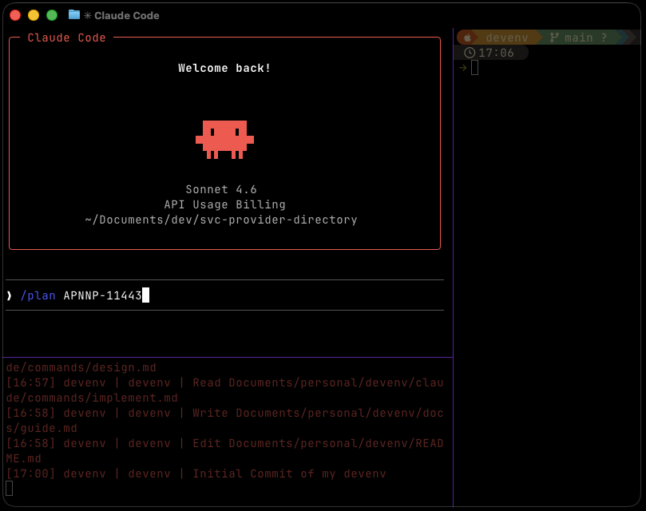

# Workflow Guide

A structured approach to building features with Claude Code — from research to shipped code.

> First time? Start with the [Getting Started](getting-started.md) guide to set up your tools.

---

## Why Structure Matters

AI coding agents can generate anything. That's the problem. Without structure, you get inconsistent patterns, drifting architecture, and one-shot attempts that miss edge cases.

This is the core insight behind **harness engineering** — the practice of building structured systems around AI agents to channel their output:

> "I like 'harness' as a word to describe the tooling and practices we can use to keep AI agents in check."
> — Birgitta Böckeler, [martinfowler.com](https://martinfowler.com/articles/exploring-gen-ai/harness-engineering.html)

The model isn't the bottleneck. The system around it is. The OpenAI team put it this way:

> "Our most difficult challenges now center on designing environments, feedback loops, and control systems."

Changing just the harness — not the model — improved coding performance by 5-14 percentage points across 15 different LLMs. The weakest models gained the most. Better structure means better output from any model.

This workflow is the harness.

---

## The Loop

```
/research → /plan → /design → /implement
     ↑                              │
     └──── re-enter on discovery ───┘
```

Each step produces an artifact that the next step reads. No step touches code until `/implement`. Every artifact is saved to `.work/` in your project — add `.work/` to your `.gitignore`.

### Running From Any Project

The workflow is project-aware. `cd` into any project folder and run the skills — they read that project's `CLAUDE.md`, scan its directory structure, and save artifacts to `.work/` within it. For new projects, `/bootstrap` scaffolds the entire project from conventions, writes a `.work/bootstrap.md` context marker, and every subsequent skill reads that marker to skip redundant questions about your tech stack.

---

## Step 1 — Research

```
/research auth
```

Scans your convention docs and codebase for context relevant to a topic. Produces a structured artifact with three sections: **Applicable Conventions** (what rules exist), **Codebase Patterns** (what's already built), and **Gaps & Recommendations** (what's missing or inconsistent).

Research is optional but valuable. It surfaces what you have before you plan what to build. The output feeds directly into `/plan`.

Run it again at any point — `/research` appends new findings without overwriting prior sections. Use `view-research` to browse saved research.

---

## Step 2 — Plan

```
/plan add recipe management
```

Claude asks clarifying questions (scope, constraints, entities), then produces a task list ordered by dependency. The plan is saved to `.work/plans/`.



If research artifacts exist for the feature, `/plan` reads them automatically — the gaps and recommendations inform the questions Claude asks and the tasks it creates.

Push back. Reorder tasks, split or merge them, add constraints. Claude won't touch code.

```
/plan                    # picker if plans exist, or ask what to plan
/plan <slug>             # refine an existing plan
```

Use `view-plan` to review plans across sessions.

---

## Step 3 — Design

```
/design
```

Claude reads the plan, explores the codebase, and produces a high-level design: architecture decisions, diagrams (saved as `.mmd` files), and a detailed spec for each task — goal, interfaces, implementation notes, acceptance criteria, and which convention docs apply.


The design is the contract for implementation. Review it. Press `ctrl-d` in `view-design` to open architecture diagrams in the browser.

For simple features where no plan exists, `/design <description>` bootstraps a minimal plan inline and proceeds to design.

---

## Step 4 — Implement

```
/implement
```

Claude loads the plan and design, displays the task list with completion status, and implements one task at a time.


It reads relevant files first, checks which conventions apply, runs existing tests to establish a baseline, implements against the spec, and re-runs tests. An implementation note is saved to `.work/implementations/`.

Completed tasks are tracked — pick up exactly where you left off across sessions.

---

## Feeding the Agent Back to Itself

The most powerful technique in this workflow isn't any single skill — it's the feedback loop.

> "When the agent struggles, we treat it as a signal: identify what is missing — tools, guardrails, documentation — and feed it back into the repository."
> — OpenAI team, cited in Böckeler's harness engineering article

In practice, this means:

### Mid-loop corrections

If `/implement` produces something that doesn't match your expectations, don't just fix the code. Ask yourself what was missing:

- **Design gap?** Run `/design refine` to tighten the spec before continuing.
- **Plan gap?** Run `/plan refine` to add a missing task or adjust scope.
- **Convention gap?** Update the convention doc so every future task gets it right.
- **New discovery?** Run `/research` to capture it — the findings will inform the next plan.

### Assessment pattern

After `/design` produces output, ask Claude to assess it honestly:

```
Can you give an assessment of this design and how it fits the project?
```

Then feed that assessment back:

```
Take this feedback and feed it back to /plan so we can get back on track.
```

This self-critique loop catches over-engineering, scope creep, and misalignment before any code is written.

### Context hygiene

Claude's output degrades as context fills up. The phased workflow helps — each skill starts with a focused read of specific artifacts rather than accumulating a session's worth of conversation.

If you've corrected Claude more than twice on the same issue, the context is cluttered with failed approaches. Run `/clear` and start fresh with a more specific prompt. A clean session with a better prompt almost always outperforms a long correction chain.

---

## Convention Docs

Convention docs are the knowledge base the agent reads at runtime. They describe patterns — how entities should look, how services are structured, how security works. This isn't documentation for humans. It's guidance the agent follows while generating code.

They live in `claude/skills/conventions/` and are discovered automatically via YAML frontmatter:

```yaml
---
keywords: [entity, model, JPA, persistence]
---
# JPA Entity Conventions

> How to structure JPA entities with Lombok...
```

`/bootstrap` reads all conventions. `/implement` reads the ones that match the task. `/research` scans them for context. The resolution is layered — personal conventions can override team conventions can override org defaults — configured in `devenv.json` under `conventions.layers`.

Edit conventions to evolve your patterns. The conventions are the harness.

---

## Tips

### Start small
Don't plan 15 tasks. Start with 3-5. You can always `/plan refine` to add more.

### Let Claude interview you
For larger features, don't write a detailed spec upfront. Give a short description and let Claude ask the questions:

```
/plan I want to add recipe management with sharing
```

The clarifying questions often surface constraints you hadn't considered.

### Review artifacts, not just code
Use `view-plan`, `view-design`, and `view-implement` between sessions. The artifacts are your project memory — they capture decisions and rationale that git commits don't.

### One task at a time
`/implement` works on a single task per invocation. This keeps context focused and changes reviewable. Resist the urge to batch.

### Commit after each task
`/implement` suggests a commit scoped to the task. Take it. Small, well-described commits make review and rollback easy.

### Use /research as a re-entry point
Discovered something unexpected during implementation? Don't try to fix everything in the current task. Run `/research` to capture it, then `/plan refine` to adjust scope. The workflow is a loop, not a line.

### Bootstrap new projects
For new projects, `/bootstrap` scaffolds everything from conventions — build config, security, database, templates — in minutes. Every subsequent skill reads the bootstrap context and skips questions about your stack.

---

## Quick Reference

| Command | What it does |
|---------|-------------|
| `/research [topic]` | Scan conventions + codebase for context |
| `/plan [description]` | Create or refine a task list |
| `/design [slug]` | Generate architecture + task specs from a plan |
| `/implement [slug [task-n]]` | Implement one task from a plan+design pair |
| `/bootstrap <name>` | Scaffold a full project from conventions |
| `view-research` | Browse saved research |
| `view-plan` | Browse saved plans |
| `view-design` | Browse saved designs (`ctrl-d` for diagrams) |
| `view-implement` | Browse implementation notes |

---

## Further Reading

- [Harness Engineering](https://martinfowler.com/articles/exploring-gen-ai/harness-engineering.html) — Birgitta Böckeler on martinfowler.com
- [Building Effective Agents](https://www.anthropic.com/engineering/building-effective-agents) — Anthropic's guide to agent patterns
- [Harness Vision](harness-vision.md) — Why this project exists
